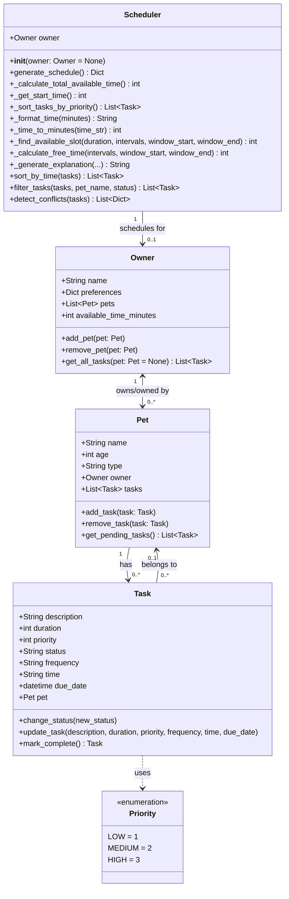

```mermaid
classDiagram
    class Priority {
        <<enumeration>>
        LOW = 1
        MEDIUM = 2
        HIGH = 3
    }

    class Owner {
        +String name
        +Dict preferences
        +List~Pet~ pets
        +int available_time_minutes
        +add_pet(pet: Pet)
        +remove_pet(pet: Pet)
        +get_all_tasks(pet: Pet = None) List~Task~
    }

    class Pet {
        +String name
        +int age
        +String type
        +Owner owner
        +List~Task~ tasks
        +add_task(task: Task)
        +remove_task(task: Task)
        +get_pending_tasks() List~Task~
    }

    class Task {
        +String description
        +int duration
        +int priority
        +String status
        +String frequency
        +String time
        +datetime due_date
        +Pet pet
        +change_status(new_status)
        +update_task(description, duration, priority, frequency, time, due_date)
        +mark_complete() Task
    }

    class Scheduler {
        +Owner owner
        +__init__(owner: Owner = None)
        +generate_schedule() Dict
        +_calculate_total_available_time() int
        +_get_start_time() int
        +_sort_tasks_by_priority() List~Task~
        +_format_time(minutes) String
        +_time_to_minutes(time_str) int
        +_find_available_slot(duration, intervals, window_start, window_end) int
        +_calculate_free_time(intervals, window_start, window_end) int
        +_generate_explanation(...) String
        +sort_by_time(tasks) List~Task~
        +filter_tasks(tasks, pet_name, status) List~Task~
        +detect_conflicts(tasks) List~Dict~
    }

    %% Relationships
    Owner "1" <--> "0..*" Pet : owns/owned by
    Pet "1" --> "0..*" Task : has
    Task "0..*" --> "0..1" Pet : belongs to
    Task ..> Priority : uses
    Scheduler "1" --> "0..1" Owner : schedules for
```
