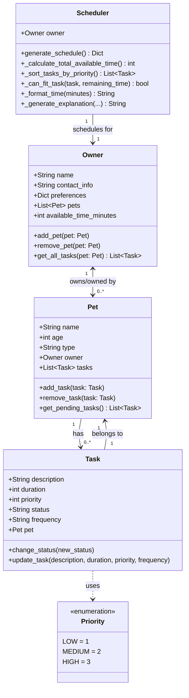

```mermaid
classDiagram
    class Priority {
        <<enumeration>>
        LOW = 1
        MEDIUM = 2
        HIGH = 3
    }

    class Owner {
        +String name
        +String contact_info
        +Dict preferences
        +List~Pet~ pets
        +int available_time_minutes
        +add_pet(pet: Pet)
        +remove_pet(pet: Pet)
        +get_all_tasks(pet: Pet) List~Task~
    }

    class Pet {
        +String name
        +int age
        +String type
        +Owner owner
        +List~Task~ tasks
        +add_task(task: Task)
        +remove_task(task: Task)
        +get_pending_tasks() List~Task~
    }

    class Task {
        +String description
        +int duration
        +int priority
        +String status
        +String frequency
        +Pet pet
        +change_status(new_status)
        +update_task(description, duration, priority, frequency)
    }

    class Scheduler {
        +Owner owner
        +generate_schedule() Dict
        +_calculate_total_available_time() int
        +_sort_tasks_by_priority() List~Task~
        +_can_fit_task(task, remaining_time) bool
        +_format_time(minutes) String
        +_generate_explanation(...) String
    }

    %% Relationships
    Owner "1" <--> "0..*" Pet : owns/owned by
    Pet "1" --> "0..*" Task : has
    Task "1" --> "1" Pet : belongs to
    Task ..> Priority : uses
    Scheduler "1" --> "1" Owner : schedules for
```